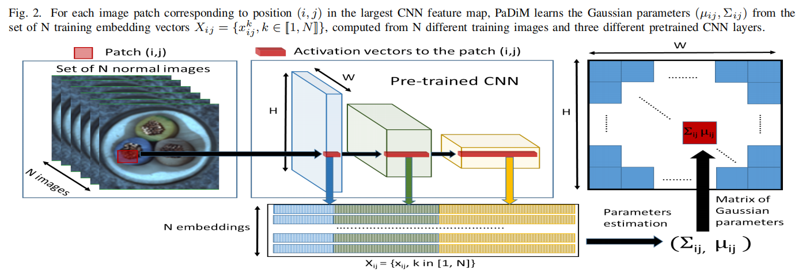

# Unsupervised-Anomaly-Detection-in-Medical-Images-via-PaDiM
a Patch Distribution Modeling Framework for Anomaly Detection and Localization in Medical Images

This is an implementation of the paper [PaDiM: a Patch Distribution Modeling Framework for Anomaly Detection and Localization](https://arxiv.org/pdf/2011.08785).   

    

## Requirement
* python == 3.7
* pytorch == 1.5
* tqdm
* sklearn
* matplotlib
